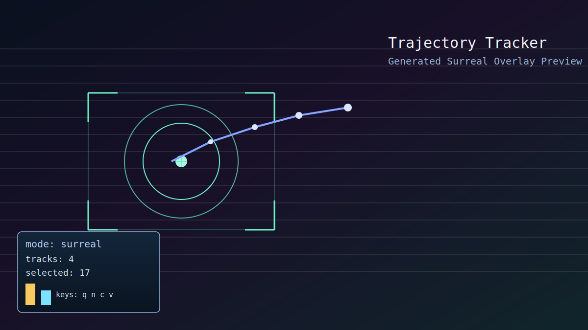
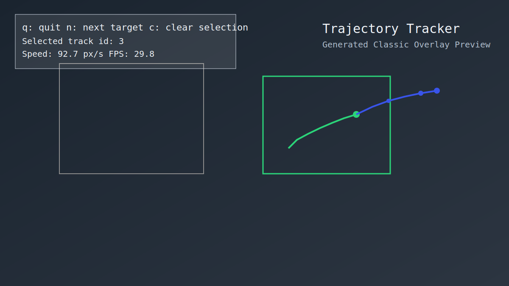

# Basic but Semi-Advance Object Detection

This project now runs detector-based trajectory tracking with short-horizon motion prediction.

## Visual Preview

### Surreal Mode (default)



### Classic Mode



## Features

- Detector-based tracking with YOLO + ByteTrack
- Stable track IDs and automatic target selection
- Target switching at runtime (`n`)
- Two overlay styles: `surreal` (default) and `classic`
- Optional class filtering (`--target-class person`)
- Real-time path overlay for observed trajectory
- Future-point prediction using polynomial regression on recent motion
- Works with webcam or video file input

## Quickstart

1. Create and activate a virtual environment.
2. Install dependencies:

```bash
pip install -r requirements.txt
```

3. Run with webcam:

```bash
python trajectory_tracker.py --source 0
```

4. Or run with a video file:

```bash
python trajectory_tracker.py --source ./sample.mp4 --target-class person
```

5. Force classic overlay style:

```bash
python trajectory_tracker.py --source 0 --visual-mode classic
```

## Controls

- `q`: quit
- `n`: cycle to next visible track id
- `c`: clear current selection (auto-select resumes)
- `v`: toggle overlay style (`surreal` <-> `classic`)

## Notes

- Tracking uses detector + tracker association from Ultralytics (`model.track`) with ByteTrack.
- First run may download model weights (default: `yolov8n.pt`).
- Prediction is computed from recent center points and updates every frame.
